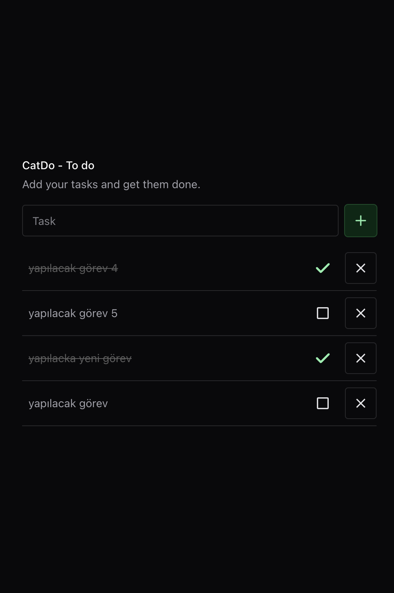

# CatDo - To Do App



Bu proje, görevlerinizi yönetmenize yardımcı olan basit bir To Do uygulamasıdır.

## Özellikler

- Görev ekleme
- Görev tamamlama
- Görev silme
- Görevlerin durumunu güncelleme

## Kurulum

### Sunucu

1. Proje dizinine gidin:
    ```bash
    cd /Users/***/Desktop/todoApp/server
    ```

2. Gerekli bağımlılıkları yükleyin:
    ```bash
    npm install
    ```

3. Veritabanı bağlantısını yapılandırın (config/db.js dosyasını düzenleyin).

4. Sunucuyu başlatın:
    ```bash
    npm start
    ```

### İstemci

1. Proje dizinine gidin:
    ```bash
    cd /Users/***/Desktop/todoApp/client
    ```

2. Gerekli bağımlılıkları yükleyin:
    ```bash
    npm install
    ```

3. İstemci uygulamasını başlatın:
    ```bash
    npm start
    ```

## Kullanım

1. Tarayıcınızı açın ve `http://localhost:3000` adresine gidin.
2. Görevlerinizi ekleyin, tamamlayın ve yönetin.

## API

### GET /tasks

Tüm görevleri getirir.

### POST /tasks/add

Yeni bir görev ekler.

### DELETE /tasks/delete/:id

Belirtilen ID'ye sahip görevi siler.

### PUT /tasks/completed/:id

Belirtilen ID'ye sahip görevin tamamlanma durumunu günceller.

## Katkıda Bulunma

Katkıda bulunmak isterseniz, lütfen bir pull request gönderin.

## Lisans

Bu proje MIT Lisansı ile lisanslanmıştır.
